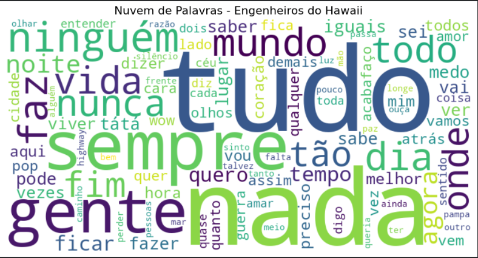
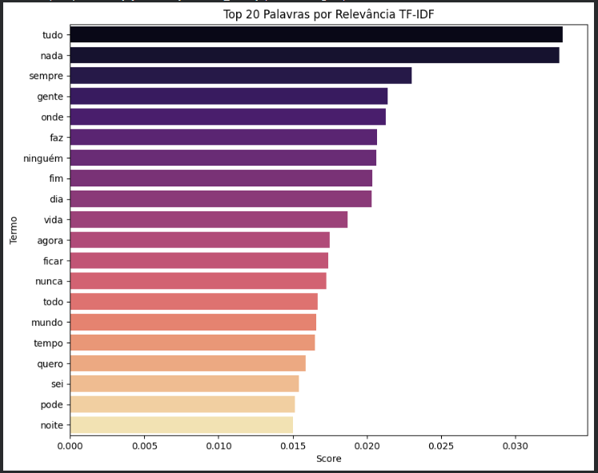
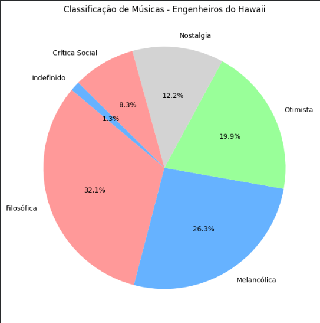

# Análise de Letras: Engenheiros do Hawaii com NLP e IA
Este projeto aplica técnicas de Processamento de Linguagem Natural (NLP) e Inteligência Artificial Generativa para analisar, classificar e emular o estilo lírico da banda brasileira Engenheiros do Hawaii.
O objetivo não foi apenas criar modelos, mas explorar como algoritmos lidam com a complexidade, ironia e existencialismo presentes nas composições de Humberto Gessinger.

# Experimentos Realizados
O projeto foi dividido em três experimentos principais para investigar diferentes capacidades da IA:

1 - Palavras e Temas Dominantes (Estatística e TF-IDF)
Objetivo: Identificar o principal vocabulário da banda.
Técnica: Limpeza de dados (Stopwords), Tokenização, Frequência Simples e TF-IDF (Term Frequency-Inverse Document Frequency).

2 - Geração de Letras (Batalha de LLMs)
Objetivo: Testar a capacidade de IAs modernas vs. modelos mais antigos de "mimetizar" o estilo da banda.
Modelos Comparados: Gemini 3 Pro e ChatGPT-5
Método: Few-Shot Prompting (fornecendo exemplos de estrofes reais para condicionar o estilo). O prompt fornecido foi:
"Crie uma letra de música no estilo da banda brasileira Engenheiros do Hawaii. Use ironia, referências culturais e temas filosóficos ou existenciais.
Aqui estão alguns exemplos de estrofes reais dos Engenheiros do Hawaii para dar contexto de estilo:
O papa é pop:
É qualquer nota qualquer notícia
Páginas em branco fotos coloridas
Qualquer nova qualquer notícia
Qualquer coisa que se mova
É um alvo
E ninguém 'tá salvo

Infinita Highway
Mas não precisamos saber pra onde vamos
Nós só precisamos ir
Não queremos ter o que não temos
Nós só queremos viver

Somos quem podemos ser
A vida imita o vídeo
Garotos inventam um novo inglês
Vivendo num país sedento
Um momento de embriaguez
Somos quem podemos ser
Sonhos que podemos ter"

3 - Classificação Intuitiva
Objetivo: Categorizar as músicas em temas semânticos usando regras léxicas.
Categorias: Melancólica, Otimista, Filosófica, Nostalgia, Crítica Social.
Método: Criação de dicionários de palavras-chave e algoritmo de contagem com match parcial (radicais).

# Resultados e Visualizações
1 - Palavras e Temas Dominantes (Estatística e TF-IDF)
A análise quantitativa revelou uma assinatura estilística clara. As duas palavras mais relevantes no corpus da banda (tanto em contagem absoluta quanto em TF-IDF) foram "Tudo" e "Nada".
Top Termos: ('tudo', 246), ('nada', 195), ('sempre', 133), ('gente', 123), ('ninguém', 115), ('faz', 113), ('mundo', 104), ('dia', 104), ('vida', 97), ('nunca', 94)
O vocabulário é predominantemente abstrato e focado na passagem do tempo (sempre/nunca/agora).

Nuvem de Palavras:

Gráfico Score TF-IDF:

2 - Geração de Letras
Trecho da música "Manual de Instruções Para Dias Improváveis" criada pelo ChatGPT:
"Estamos vivos — por enquanto
Rindo do próprio desencanto
Num país que aprende filosofia
Assistindo debate no intervalo da novela das oito
E acreditando no que vem pronto"

Trecho da música "O Algoritmo de Sísifo" criada pelo Gemini:
"Derrubamos muros pra viver em condomínios fechados 
A tal liberdade é um plano de dados ilimitados 
Crescemos tanto que batemos a cabeça no teto de vidro 
O futuro é um filme cult que ninguém tem assistido 
Eles dizem que a terra é plana, eu digo que a vida é chata 
Navegando em círculos num barco de sucata."

Análise: As duas IAs criaram letras com temas de tecnologia e sociedade, parecidos com o estilo dos Engenheiros do Hawaii. O Gemini se saiu melhor porque manteve uma linha de raciocínio mais coesa durante toda a música, falando sobre as contradições modernas - tipo "derrubamos muros mas vivemos em condomínios fechados" e "liberdade virou plano de dados ilimitados". Essas frases têm aquele jogo de palavras irônico que a banda usa, enquanto o ChatGPT pareceu jogar frases filosóficas soltas em cada verso, como se tentasse imitar o estilo sem conectar direito as ideias. O Gemini também usou bem mais o vocabulário dominante da banda que identificamos antes (39% das palavras-chave como "tudo", "nada", "ninguém" contra apenas 25% do ChatGPT). Quanto ao tom, o Gemini captou melhor aquele cinismo inteligente dos Engenheiros - não fica reclamando, só aponta o absurdo com ironia. O ChatGPT ficou mais no tom de lamentação. O Gemini ainda mostrou entender da sonoridade da banda, sugerindo "baixo marcante" e "solo melódico e limpo", enquanto o ChatGPT focou só na letra. Os temas são similares aos originais (alienação, busca existencial, crítica social), mas o Gemini trabalhou isso de forma mais densa e paradoxal, igual a banda faz, enquanto o ChatGPT foi mais superficial e explicativo.

3 - Classificação Intuitiva
Utilizamos um classificador baseado em léxicos para rotular as músicas. No roteiro original, pretendiamos criar apenas 3 dicionários (filosófico, otimista e melancólico), mas durante o desenvolvimento da atividade, achamos interessante crescer o escopo da classificação de sentimentos, uma vez que as músicas de Engenheiros abordam bastante sobre crítica social e nostalgia, e do modo que estava, o algoritmo classificava muitas músicas como indefinidas ou dava a classificação errada por falta de uma categoria de sentimento que se adequasse melhor. Assim, adicionamos os dicionários "Nostalgia" e "Crítica Social".

A distribuição ficou da seguinte maneira:
Filosófica: 50

Melancólica: 41

Otimista: 31

Nostalgia: 19

Crítica Social: 13

Indefinido: 2

Gráfico da Análise Intuitiva:

Também analisamos como o algoritmo classificou 5 músicas especificas: 

Música: 'Infinita Highway' -> Classificada como: FILOSÓFICA

Música: 'Pra Ser Sincero' -> Classificada como: FILOSÓFICA

Música: 'O Papa é Pop' -> Classificada como: CRÍTICA SOCIAL

Música: 'Refrão de Bolero' -> Classificada como: OTIMISTA

Música: 'Era um Garoto que como Eu Amava os Beatles e os Rolling Stones' -> Classificada como: NOSTALGIA

Nossa análise ficou assim:
A classificação fez sentido em algumas músicas, mas achamos que errou em outras.

"Infinita Highway" como FILOSÓFICA - Faz todo sentido. A música fala sobre ir sem saber pra onde, sobre viver o caminho e não o destino. É bem existencialista mesmo.

"Pra Ser Sincero" como FILOSÓFICA - Também faz sentido. A letra questiona relacionamentos, sinceridade, expectativas em uma relação.

"O Papa é Pop" como CRÍTICA SOCIAL - Acertou. Essa música é crítica e irônica, fala sobre alienação da mídia e cultura de massa, é provocativa e crítica.

"Refrão de Bolero" como OTIMISTA - Achamos que a IA errou. A música fala de um amor meio que perdido, de um erro cometido "Agora me arrependo / Roendo as unhas". É mais melancólica, não otimista, mas é compreensível que a IA tenha se confundido, uma vez que os sentimentos "concretos" declarados em palavras nessa música não são tão claros.

"Era um Garoto que como Eu Amava os Beatles e os Rolling Stones" como NOSTALGIA - Faz sentido, em partes. A música realmente fala de memórias da juventude, dos Beatles e Rolling Stones, de um tempo que já foi. Entretanto, o centro da música se concentra na crítica ao contexto dabrutalidade da Guerra do Vietnã, refletindo que a juventude, sonhos e a guitarra foi tirada do jovem, dando lugar a morte, a violência, ao instrumento que faz "ra ta ta ta", se referindo a uma arma. Portanto, achamos que a música deveria ser considerada de CRÍTICA SOCIAL.
